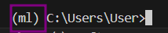
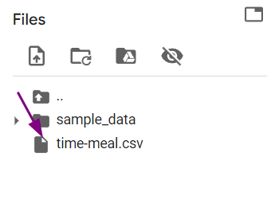
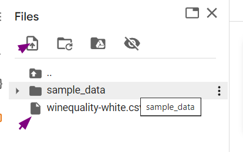

Requirements:
1. Python and  anaconda launcher installed upon https://www.python.org/downloads/
https://www.anaconda.com/download
2. Create a new virtual environment 
3. `conda create -n ml` `CONDA ACTIVATE ML`
4. 
5. `pip install notebook` to download jupyter notebook
6. `pip install -r install.txt`
7. To run assignment 01:
 upload the time-meal.csv in the following manner
 
 https://colab.research.google.com/drive/1T9lORW75ZsUWsKyDN4OjdMft8l1JpxDZ?usp=sharing
 To run assignment 02:
 Upload 
 
https://colab.research.google.com/drive/10pg05E_q-Y9e6B0Z5LEb8sVSzONebboU
